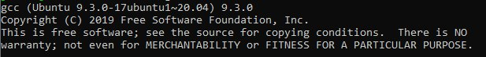

## Linux
* Todo

### C Compiler installieren

Nun installiert ihr ``gcc``, dies ist ein [Compiler](https://de.wikipedia.org/wiki/Compiler) für C.

1. Startet WSL, z.B. in dem ihr ``Windows Taste`` + ``R`` drückt und ``cmd`` eingebt.
2. Jetzt seht ihr das Windows-Terminal, dort gebt ihr ``wsl.exe`` ein.
3. In das nun geöffnete Linux-Terminal gebt ihr ``sudo apt update`` ein, dies updatet die Package-Listen
4. Installiert nun ``gcc`` via ``sudo apt install gcc``, bestätigt mit ``yes``
5. Um zu überprüfen, dass alles geklappt hat gebt ``gcc --version`` ein, es müsste ähnlich zum Screenshot aussehen.`

