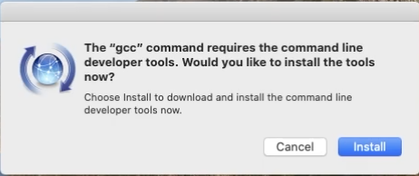

## MacOS
Auf dieser Seite wollen wir euch die ersten Sritte erklären, wie ihr C-Code auf einem Mac compilieren könnt. Dadurch, dass macOS ein sehr Unix nahes Betriebssytem ist, ist das zum Glück nicht alzu kompliziert
* Zusätzliche Compiler Flags
* Testen mit SSH auf ubu18@eecs

## C-Compiler
Als erstes solltet ihr euer Terminal öffnen. Dies könnt ihr am schnellsten machen indem ihr die Suchleiste mithilfe von command und space öffnet und dann einfach Terminal eingebt.

Nun könnt ihr euren Compiler installieren. Der simpelste Weg hierfür ist einfach 
```
gcc
```
oder
```
gcc -version
```
in euer Terminal einzugeben, woraufhin sich dieses Fenster öffnen sollte:



dort klickt ihr einfach auf "Intallieren" und schon habt ihr den Compiler installiert.

Eine andere Methode wäre es mit [homebrew](https://brew.sh) zu installieren. Hierfür müsst ihr euch erstmal homebrew installieren. Dies macht ihr indem ihr das Terminal öffnet und den Link auf der Webseite hinein kopiert. Sobald das geschen ist müsst ihr nur noch
```
brew install gcc
```
in eurem Terminal eingeben und gcc ist fertig installiert.


### SSH
Wärend des nächsten Semesters werdet ihr auch mit Vallgrind arbeiten, wie ihr schnell feststellen werdet ist Vallgrind nur für X86/MacOSX 10.12 und AMD64/MacOSX 10.12. erhältlich. Hierfür ist es praktisch die Uniserver zu benutzen, wenn möglich sind dafür die Rechnerräume wie zum Beispiel im TEL eine gute Anlaufstelle. Wenn der Zutritt dazu Momentan allerdings nicht möglich ist, oder ihr aus anderen Gründen lieber aneurem Computer arbeiten wollt, gibt es die Möglichkeit per [Secure Shell](https://www.campusmanagement.tu-berlin.de/menue/dienste/daten_server/andrew_file_system/anleitungen_und_hinweise/zugriff_via_ssh_zugang/) (SSH) ([näheres](https://wiki.freitagsrunde.org/SSH)) auf die Uniserver zuzugreifen und dort Valgrind auzuführen. Der Zugriff per SSH ist auch zu empfehlen um Hausaufgaben oder ähnliches noch einmal zu kompilieren und auszuführen. Da es vorkommen kann, dass ein Programm auf eurem eigenen Computer zwar einwandfrei kompiliert, aber bei Linus Systemen eventuell Probleme aufkommen.

### IDE oder nicht?
Ihr könnt euch nun entscheiden ob ihr eine Integrierte Entwicklungsumgebung (IDE) (z.B. [CLion](https://www.jetbrains.com/de-de/clion/)) oder einen Texteditor (z.B. [Atom](https://atom.io)) und das Terminal nutzt. An sich ist CLion zum Beispiel leichter zu handhaben, wenn es darum geht euren Code zu debuggen. Man muss hierbei jedoch beachten, dass manche Sachen, wie zum Beispiel pipen, in CLion nicht funktionieren. Also wenn ihr denkt, dass das Programm eigentlich ohne Probleme aufgerufen werden sollte und es das nicht tut, probiert am besten mal aus es anders auszuführen.
