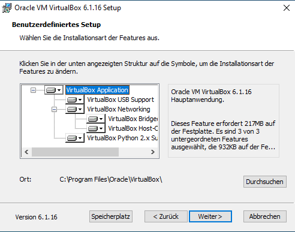

## Virtual Machines

Eine Virtual Machine (VM) ist eine Virtualisierungstechnologie bei der ein komplettes [Operating System](https://de.wikipedia.org/wiki/Betriebssystem) (OS) simmuliert wird.
```
Als virtuelle Maschine (VM) wird in der Informatik die Software-technische Kapselung eines Rechnersystems 
innerhalb eines lauffähigen Rechnersystems bezeichnet. Die virtuelle Maschine bildet die Rechnerarchitektur 
eines real in Hardware existierenden oder eines hypothetischen Rechners nach.
```
[Wikipedia](https://de.wikipedia.org/wiki/Virtuelle_Maschine)

For the sake of simplicity stellen wir hier nur eine Virtual Machine vor und das [VirtualBox](https://de.wikipedia.org/wiki/VirtualBox) (VB) von Oracle.

## Installation

[Hier](https://www.virtualbox.org/wiki/Downloads) könnt ihr VB runterladen, 
dazu klickt auf den Link und dann auf ``Windows hosts``. Nun führt ihr die Exe aus 
und folgt den Steps.





Hier auf ``Ja`` drücke, damit eure VB später auch einen Internetzugang hat.


Hier auf ``Installieren`` klicken, dies dient dazu, das Windows eine Schnittstelle 
zwischen Windows und der VB herstellen kann.

Nun habt ihr VB erfolgreich installiert.

## Einrichtung

Nun müsst ihr euch eine ISO herunterladen, wir nehmen hier als Beispiel 
``Ubuntu 20.04.1``, falls es bei euch eine neuere Variante gibt, nutzt diese. Ubuntu könnt ihr [hier](https://ubuntu.com/download/desktop) herunterladen.
Achtet nur auf das ``LTS`` am Ende. 

```LTS stands for long-term support — which means five years, until April 2025, of free security and maintenance updates, guaranteed.```


Sobald ihr VB startet sollte die GUI so, oder so ähnlich, aussehen


Nun klickt ihr auf ``Neu``.


Wählt dann die entsprechenden Attribute, der ``Name`` ist egal, der rest sollte zu eurer ISO passen.
Falls ihr euch für Ubuntu entschieden habt, könnt ihr die Attribute ``Typ`` und ``Version`` so übernehmen.
Hier die richtigen Attribute zu wählen ist entscheidend, damit die VB weiß wie sie das zu installierende Betriebssystem anzusprechen hat.


In diesem Schritt geht es darum wie viel Gigabyte von eurem [Random-Access Memory](https://de.wikipedia.org/wiki/Random-Access_Memory) (RAM)
der VB zu stehen, ein guter Startwert ist 1/3 von eurem Gesamt-RAM. Bei 8 GB RAM, 1-2 GB.

**Achtung** auf dem Screenshot steht Hauptspeicher, damit wird in der Informatik meist der RAM gemeint und nicht wie 
 vermuten lässt die Festplatte (da wo ihr eure Datein drauf abspeichert).

 
 


Bei diesem Schritt und den folgenden geht es nun um die Festplatte.
Falls ihr kein Vorwissen habt, oder euch nicht sicher seid, übernehmt die Einstellungen aus den Screenshots.


Nun habt ihr erfolgreich eine Virtualmachine aufgesetzt.


## ISO installieren


Nun klickt auf den Order mit dem kleinen grünen Pfeil, daraufhin öffnet sich ein neues Fenster.


Nun klickt auf Hinzufügen und navigiert zu dem Ordner wo ihr die ISO von vorhin runtergeladen habt.


Drückt auf ``Auswählen``

Nun bestätigt ihr alle Fragen & eure VB müsste Ubuntu starten, dies kann etwas dauern.

Für die weiteren Einstellungen folgt diesem 
[Tutorial](https://ubuntu.com/tutorials/install-ubuntu-desktop#6-allocate-drive-space]) ab Punkt 6.


## Hinweis


Bei der Installation von Ubuntu werdet Ihr auf diese Seite stoßen, 
dabei müsst ihr keine Angst haben. Dabei werden nicht euren Dateien gelöscht, 
die VB ist gekapselt und es wird freier Speicherplatz genutzt.