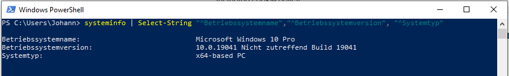
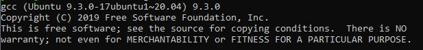

## Windows-Subsystem für Linux

Windows-Subsystem für Linux (**WSL**) ist eine Virtualisierungstechnologie, um einen [Linux-Kernel](https://de.wikipedia.org/wiki/Kernel_(Betriebssystem)) unter Windows auszuführen.

### WSL 1 vs. WSL 2
Bevor wir uns um die Installation kümmern, müsst ihr euch entscheiden, ob ihr **WSL 1**, oder **WSL 2** verwenden wollt.
Wir empfehlen **WSL 2**, da es einige Vorteile gegenüber **WSL 1** bietet: [weitere Infos](https://docs.microsoft.com/de-de/windows/wsl/compare-versions).

### Anforderungen für WSL

**WSL** wird im Moment nur von Windows 10 [64-Bit](https://de.wikipedia.org/wiki/64-Bit-Architektur) unterstützt.
Außerdem wird für **WSL 1** mindestens Windows Build 16215 benötigt und für **WSL 2** mindestens Windows Build 18917.
Das lässt sich ganz einfach überprüfen, indem in PowerShell
```
systeminfo | Select-String "^Betriebssystemname","^Betriebssystemversion", "^Systemtyp"
```

eingegeben wird.



**Achtung** je nach Sprache eures Betriebssystem unterscheiden sich die Begriffe nach `Select String`, es genügt auch nur `systeminfo` einzugeben.
Nun wird der Betriebssystemname, Betriebssystemversion & der Systemtyp angezeigt.

Bei Betriebssystemname & Betriebssystemversion können unterschiedliche Inhalte im Gegensatz zum Screenshot stehen, solange oben genannte Kriterien erfüllt sind.
Wichtig ist, dass bei Systemtyp **x64** (64 Bit) steht, falls dort **x86** (32 Bit) steht, dann könnt ihr WSL nicht auf eurem PC installieren.

#### Installation von WSL
Da bei der Installation über die Zeit Kleinigkeiten verändern können, verlinken wir [hier](https://docs.microsoft.com/de-de/windows/wsl/install-win10) nur auf die offizielle Seite von Microsoft.


### C Compiler installieren

Nun installiert ihr ``gcc``, dies ist ein [Compiler](https://de.wikipedia.org/wiki/Compiler) für C.

1. Startet WSL, z.B. in dem ihr ``Windows Taste`` + ``R`` drückt und ``cmd`` eingebt.
2. Jetzt seht ihr das Windows-Terminal, dort gebt ihr ``wsl.exe`` ein.
3. In das nun geöffnete Linux-Terminal gebt ihr ``sudo apt update`` ein, dies updatet die Package-Listen
4. Installiert nun ``gcc`` via ``sudo apt install gcc``, bestätigt mit ``yes``
5. Um zu überprüfen, dass alles geklappt hat gebt ``gcc --version`` ein, es müsste ähnlich zum Screenshot aussehen.`



### Video zur Installation

Tobias hat ein Video aufgenommen, in dem er zeigt wie ihr WSL und einen Compiler auf Windows 10 installieren könnt.
Ihr findet das Video [hier in der TubCloud](https://tubcloud.tu-berlin.de/s/xWcZXpPAnDH8MWg).
